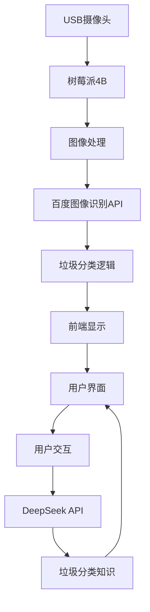

# 基于树莓派的垃圾分类助手

*使用树莓派4B、USB摄像头和AI API实现的智能垃圾分类系统*

## 项目概述

这是一个基于树莓派4B的智能垃圾分类系统，结合了计算机视觉和自然语言处理技术。系统通过USB摄像头实时识别垃圾物品，使用百度图像识别API进行分类，并通过DeepSeek API提供垃圾分类知识解答。

**核心功能：**
- 🎥 实时垃圾物品识别
- ♻️ 垃圾分类（可回收物、有害垃圾、厨余垃圾、其他垃圾）
- 🤖 AI垃圾分类知识问答
- 🌐 Web界面远程访问

## 技术栈

### 硬件
- 树莓派4B (推荐4GB RAM版本)
- USB摄像头 (支持Linux UVC)
- 电源适配器 (5V/3A)
- Micro SD卡 (16GB以上)

### 软件
- Python 3.9+
- Flask Web框架
- OpenCV (计算机视觉)
- Pillow (图像处理)
- Requests (API调用)

### API服务
1. **百度图像识别API** - 用于物品识别
2. **DeepSeek API** - 用于垃圾分类知识解答

## 系统架构



## 安装步骤

### 1. 克隆仓库
```bash
git clone https://github.com/your-username/garbage-classifier.git
cd garbage-classifier
```

### 2. 安装依赖
```bash
sudo apt update
sudo apt install python3-pip python3-venv libatlas-base-dev libjasper-dev libqtgui4 libqt4-test

# 安装中文字体
sudo apt install fonts-wqy-microhei

# 创建虚拟环境
python3 -m venv venv
source venv/bin/activate

# 安装Python依赖
pip install -r requirements.txt
```

### 3. 配置API密钥
创建 `.env` 文件并添加你的API密钥：
```env
# 百度图像识别API
BAIDU_API_KEY=your_baidu_api_key
BAIDU_SECRET_KEY=your_baidu_secret_key

# DeepSeek API
DEEPSEEK_API_KEY=your_deepseek_api_key
```

### 4. 设置摄像头权限
```bash
sudo usermod -a -G video $USER
echo 'SUBSYSTEM=="vchiq",MODE="0666"' | sudo tee /etc/udev/rules.d/99-vchiq-permissions.rules
sudo reboot
```

## 连接树莓派的三种方式

### 1. 查找树莓派IP地址
- **方法1：使用路由器管理界面**
  1. 登录路由器管理页面（通常为192.168.1.1或192.168.0.1）
  2. 在"连接设备"或"DHCP客户端列表"中查找名为"raspberrypi"的设备
  3. 记录对应的IP地址（如192.168.1.100）

- **方法2：使用手机APP扫描**
  1. 在手机应用商店下载"Fing"或"局域网扫描"工具
  2. 连接与树莓派相同的Wi-Fi网络
  3. 扫描网络设备，查找树莓派设备

- **方法3：使用命令行（需要显示器）**
  ```bash
  hostname -I
  # 输出示例：192.168.1.100
  ```

> 详细教程可参考CSDN文章：[树莓派IP地址查找方法大全](https://blog.csdn.net/xxx/article/xxx)

### 2. 使用VNC连接树莓派桌面
1. **在树莓派上启用VNC服务**
   ```bash
   sudo raspi-config
   # 选择 Interfacing Options → VNC → Yes
   ```

2. **安装VNC Viewer客户端**
   - 下载地址：[RealVNC Viewer](https://www.realvnc.com/en/connect/download/viewer/)
   - 支持Windows/Mac/Linux/Android/iOS

3. **连接树莓派**
   - 打开VNC Viewer
   - 输入树莓派IP地址（如192.168.1.100）
   - 用户名：pi，默认密码：raspberry

> 详细教程可参考CSDN文章：[树莓派VNC远程桌面配置指南](https://blog.csdn.net/xxx/article/xxx)

### 3. 使用VS Code SSH连接树莓派
1. **在树莓派上启用SSH服务**
   ```bash
   sudo raspi-config
   # 选择 Interfacing Options → SSH → Yes
   ```

2. **在VS Code中安装Remote-SSH扩展**
   - 扩展市场搜索并安装"Remote - SSH"

3. **配置SSH连接**
   1. 按F1打开命令面板
   2. 输入"Remote-SSH: Add New SSH Host"
   3. 输入：`pi@<树莓派IP地址>`（如`pi@192.168.1.100`）
   4. 选择配置文件路径（默认即可）
   5. 点击左下角绿色连接按钮

4. **首次连接**
   - 输入密码：raspberry（默认）
   - 选择Linux平台
   - 连接成功后即可在VS Code中操作树莓派

> 详细教程可参考CSDN文章：[VS Code远程开发树莓派教程](https://blog.csdn.net/xxx/article/xxx)

## 运行系统

### 开发模式
```bash
source venv/bin/activate
python app.py
```


## 访问系统

在浏览器中访问：
```
http://<树莓派IP地址>:5000
```

## 使用说明

1. **实时识别**：
   - 系统会自动识别摄像头视野中的垃圾物品
   - 显示物品名称、分类和置信度

2. **AI助手**：
   - 在右侧面板输入垃圾分类相关问题
   - 点击推荐问题快速提问
   - 使用"智能提问"按钮基于当前识别结果提问

3. **控制功能**：
   - 刷新页面：重新加载网页
   - 停止摄像头：停止视频流处理
   - 系统状态：显示当前运行状态

## 项目结构

```
garbage-classifier/
├── app.py                 # Flask主应用
├── requirements.txt       # Python依赖
├── .env                   # API密钥配置
├── templates/
│   └── index.html         # 前端页面
├── baidu_access_token.txt # 百度API令牌缓存
└── README.md              # 项目文档
```

## 自定义配置

在 `app.py` 中可以修改以下参数：

```python
# 摄像头参数
CAMERA_INDEX = 0           # 摄像头设备号 (0,1,2...)
TARGET_WIDTH = 640         # 显示宽度
TARGET_HEIGHT = 480        # 显示高度
CAMERA_WIDTH = 320         # 摄像头采集宽度
CAMERA_HEIGHT = 240        # 摄像头采集高度
FPS = 10                   # 摄像头帧率
API_INTERVAL = 2.0         # API调用间隔(秒)

# 分类阈值
GARBAGE_MAPPING = {
    "塑料瓶": {"type": "可回收物", "confidence": 0.6},
    # 其他物品配置...
}
```

## 常见问题解决

**问题：摄像头无法打开**
```bash
# 检查摄像头设备
ls /dev/video*

# 尝试不同设备号
# 在app.py中修改 CAMERA_INDEX = 0 → 1,2 等

# 临时权限修复
sudo chmod 666 /dev/video0
```

**问题：中文显示乱码**
```bash
# 安装中文字体
sudo apt install fonts-wqy-microhei
```

**问题：API调用失败**
- 检查 `.env` 文件中的API密钥
- 检查网络连接
- 查看日志中的错误信息


## 贡献指南

欢迎贡献代码！请遵循以下步骤：
1. Fork 项目仓库
2. 创建特性分支 (`git checkout -b feature/your-feature`)
3. 提交更改 (`git commit -am 'Add some feature'`)
4. 推送分支 (`git push origin feature/your-feature`)
5. 创建Pull Request

## 许可证

本项目采用 MIT 许可证 - 详情请参阅 [LICENSE](LICENSE) 文件。

## 致谢

- 百度AI开放平台 - 提供图像识别API
- DeepSeek - 提供自然语言处理API
- Raspberry Pi基金会 - 提供优秀的硬件平台

---
**让科技为环保助力，一起建设更绿色的地球！** 🌍♻️