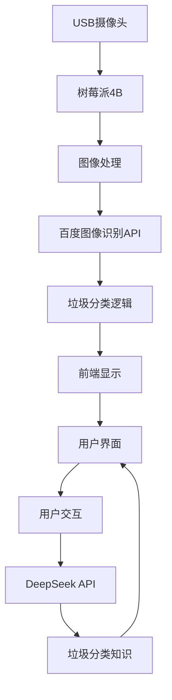

# 基于树莓派的垃圾分类助手

  
*使用树莓派4B、USB摄像头和AI API实现的智能垃圾分类系统*

## 项目概述

这是一个基于树莓派4B的智能垃圾分类系统，结合了计算机视觉和自然语言处理技术。系统通过USB摄像头实时识别垃圾物品，使用百度图像识别API进行分类，并通过DeepSeek API提供垃圾分类知识解答。

**核心功能：**
- 🎥 实时垃圾物品识别
- ♻️ 垃圾分类（可回收物、有害垃圾、厨余垃圾、其他垃圾）
- 🤖 AI垃圾分类知识问答
- 🌐 Web界面远程访问

## 技术栈

### 硬件
- 树莓派4B (推荐4GB RAM版本)
- USB摄像头 (支持Linux UVC)
- 电源适配器 (5V/3A)
- Micro SD卡 (16GB以上)

### 软件
- Python 3.9+
- Flask Web框架
- OpenCV (计算机视觉)
- Pillow (图像处理)
- Requests (API调用)

### API服务
1. **百度图像识别API** - 用于物品识别
2. **DeepSeek API** - 用于垃圾分类知识解答

## 系统架构


```mermaid
graph TD
    A[USB摄像头] --> B[树莓派4B]
    B --> C[图像处理]
    C --> D[百度图像识别API]
    D --> E[垃圾分类逻辑]
    E --> F[前端显示]
    F --> G[用户界面]
    G --> H[用户交互]
    H --> I[DeepSeek API]
    I --> J[垃圾分类知识]
    J --> G
```

## 安装步骤

### 1. 克隆仓库
```bash
git clone https://github.com/your-username/garbage-classifier.git
cd garbage-classifier
```

### 2. 安装依赖
```bash
sudo apt update
sudo apt install python3-pip python3-venv libatlas-base-dev libjasper-dev libqtgui4 libqt4-test

# 安装中文字体
sudo apt install fonts-wqy-microhei

# 创建虚拟环境
python3 -m venv venv
source venv/bin/activate

# 安装Python依赖
pip install -r requirements.txt
```

### 3. 配置API密钥
创建 `.env` 文件并添加你的API密钥：
```env
# 百度图像识别API
BAIDU_API_KEY=your_baidu_api_key
BAIDU_SECRET_KEY=your_baidu_secret_key

# DeepSeek API
DEEPSEEK_API_KEY=your_deepseek_api_key
```

### 4. 设置摄像头权限
```bash
sudo usermod -a -G video $USER
echo 'SUBSYSTEM=="vchiq",MODE="0666"' | sudo tee /etc/udev/rules.d/99-vchiq-permissions.rules
sudo reboot
```

## 运行系统

### 开发模式
```bash
source venv/bin/activate
python app.py
```

### 生产模式 (使用systemd服务)
```bash
# 创建服务文件
sudo nano /etc/systemd/system/garbage-classifier.service
```

添加以下内容：
```ini
[Unit]
Description=Garbage Classifier Web Service
After=network.target

[Service]
User=pi
WorkingDirectory=/home/pi/garbage-classifier
Environment="PATH=/home/pi/garbage-classifier/venv/bin"
ExecStart=/home/pi/garbage-classifier/venv/bin/python app.py
Restart=always
RestartSec=10

[Install]
WantedBy=multi-user.target
```

启用并启动服务：
```bash
sudo systemctl daemon-reload
sudo systemctl enable garbage-classifier
sudo systemctl start garbage-classifier
sudo systemctl status garbage-classifier
```

## 访问系统

在浏览器中访问：
```
http://<树莓派IP地址>:5000
```

## 使用说明

1. **实时识别**：
   - 系统会自动识别摄像头视野中的垃圾物品
   - 显示物品名称、分类和置信度

2. **AI助手**：
   - 在右侧面板输入垃圾分类相关问题
   - 点击推荐问题快速提问
   - 使用"智能提问"按钮基于当前识别结果提问

3. **控制功能**：
   - 刷新页面：重新加载网页
   - 停止摄像头：停止视频流处理
   - 系统状态：显示当前运行状态

## 项目结构

```
garbage-classifier/
├── app.py                 # Flask主应用
├── requirements.txt       # Python依赖
├── .env                   # API密钥配置
├── templates/
│   └── index.html         # 前端页面
├── static/
│   └── demo.gif           # 演示动图
├── baidu_access_token.txt # 百度API令牌缓存
└── README.md              # 项目文档
```

## 自定义配置

在 `app.py` 中可以修改以下参数：

```python
# 摄像头参数
CAMERA_INDEX = 0           # 摄像头设备号 (0,1,2...)
TARGET_WIDTH = 640         # 显示宽度
TARGET_HEIGHT = 480        # 显示高度
CAMERA_WIDTH = 320         # 摄像头采集宽度
CAMERA_HEIGHT = 240        # 摄像头采集高度
FPS = 10                   # 摄像头帧率
API_INTERVAL = 2.0         # API调用间隔(秒)

# 分类阈值
GARBAGE_MAPPING = {
    "塑料瓶": {"type": "可回收物", "confidence": 0.6},
    # 其他物品配置...
}
```

## 常见问题解决

**问题：摄像头无法打开**
```bash
# 检查摄像头设备
ls /dev/video*

# 尝试不同设备号
# 在app.py中修改 CAMERA_INDEX = 0 → 1,2 等

# 临时权限修复
sudo chmod 666 /dev/video0
```

**问题：中文显示乱码**
```bash
# 安装中文字体
sudo apt install fonts-wqy-microhei
```

**问题：API调用失败**
- 检查 `.env` 文件中的API密钥
- 检查网络连接
- 查看日志中的错误信息

## 未来扩展计划

1. **离线模式**：使用本地模型替代API调用
2. **多语言支持**：添加英语等多语言界面
3. **数据统计**：记录分类历史并生成报告
4. **移动应用**：开发配套的移动端应用
5. **硬件集成**：添加机械臂实现自动分类

## 贡献指南

欢迎贡献代码！请遵循以下步骤：
1. Fork 项目仓库
2. 创建特性分支 (`git checkout -b feature/your-feature`)
3. 提交更改 (`git commit -am 'Add some feature'`)
4. 推送分支 (`git push origin feature/your-feature`)
5. 创建Pull Request

## 许可证

本项目采用 MIT 许可证 - 详情请参阅 [LICENSE](LICENSE) 文件。

## 致谢

- 百度AI开放平台 - 提供图像识别API
- DeepSeek - 提供自然语言处理API
- Raspberry Pi基金会 - 提供优秀的硬件平台

---
**让科技为环保助力，一起建设更绿色的地球！** 🌍♻️
